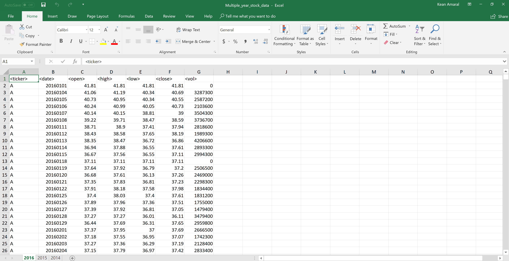
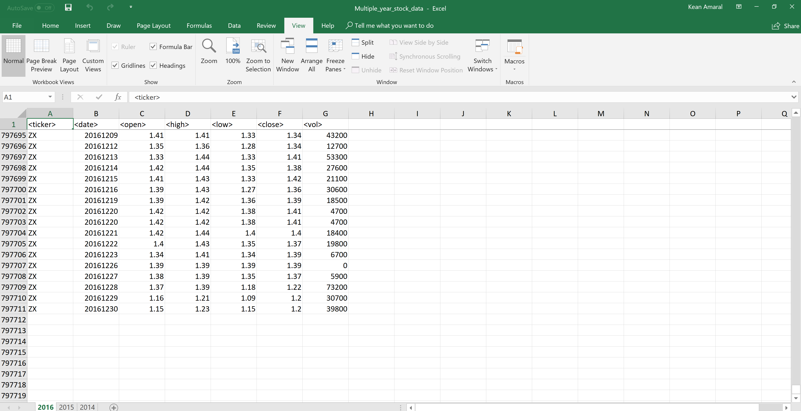
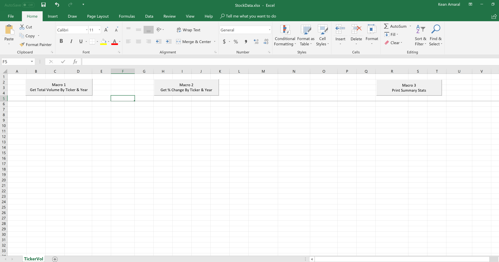
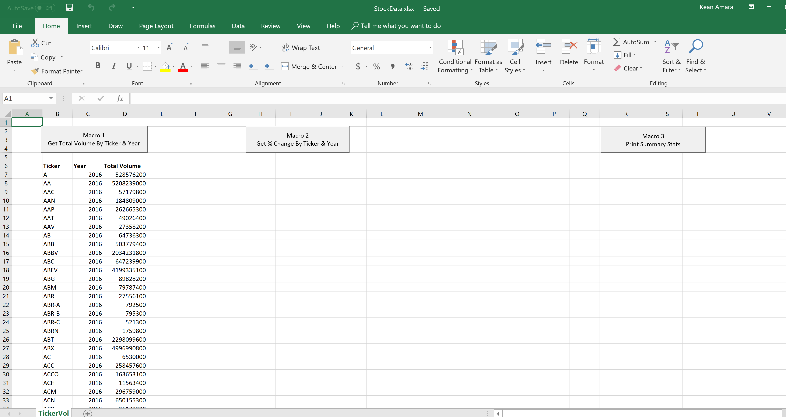
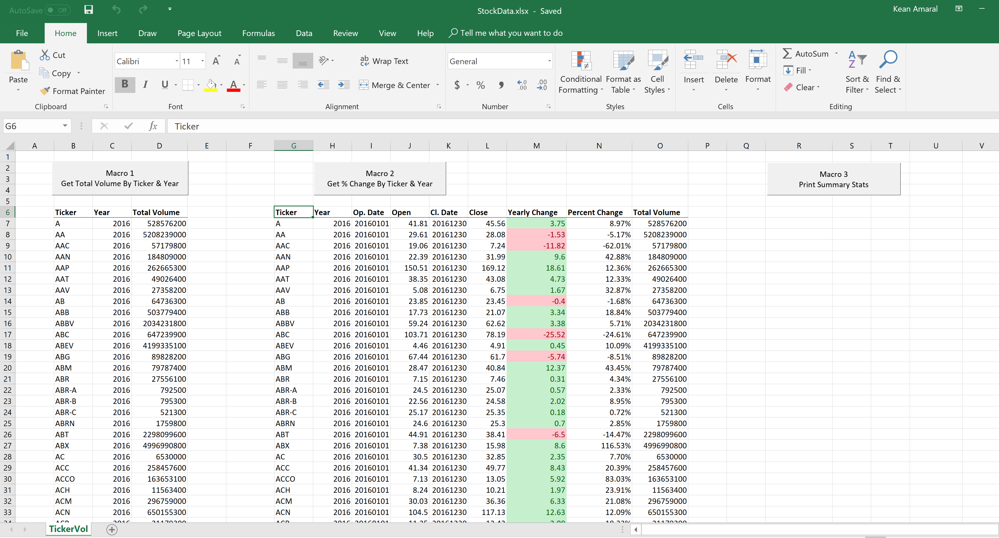
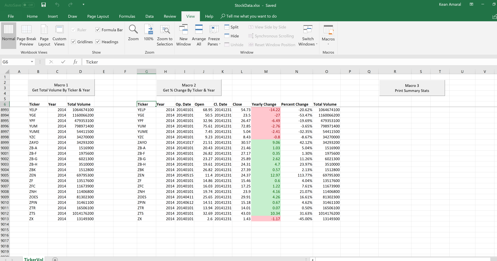
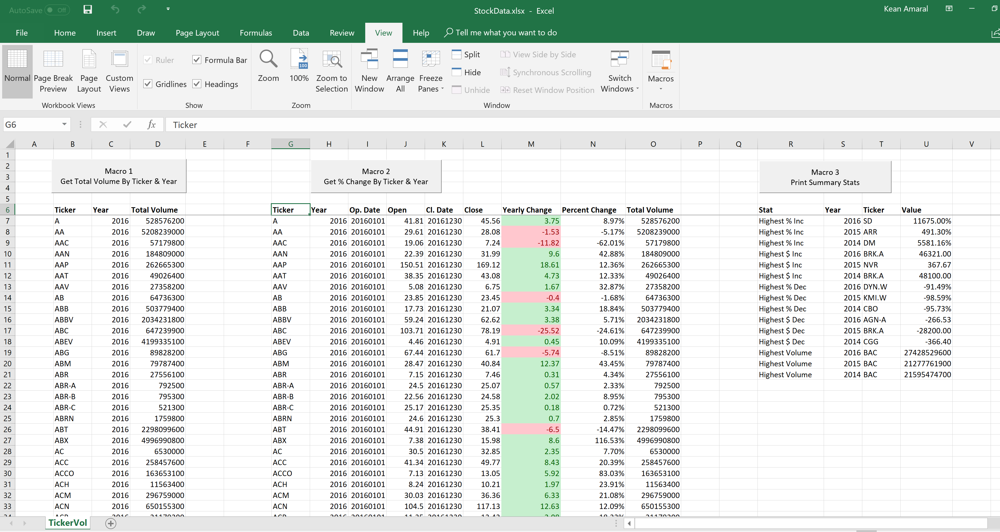
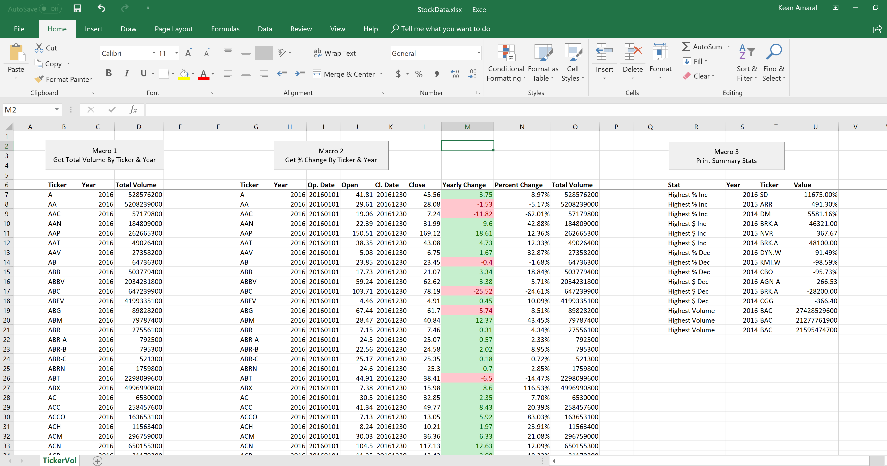

# VBA-StockData
## VBA scripting to analyze real stock market data
- - -

## Raw Data
We are given "raw" stock market data consisting of stock price and volume for each day of each year by ticker in an excel spreadsheet.  The data consists of the following headers: 

**`ticker, date, open, high, low, close, vol`**

The raw data has 3 years data for 2016, 2015, 2014 with approximately 80,000 rows per year (sheet).

## Goal and Approach

We place the raw data in a **`raw_data folder`** and consider it as **`the raw data`** file.  The raw data file is approximately 100 mb large and using the same file to process the data analysis using **`excel formulas`** and **`vba`** poses a challenge because excel would hang because of the size file.

It makes it more efficient to process the data analysis in a **`completely separate blank`** excel spreadsheet so that we can keep the **`results spreadsheet`** light and as the raw data keeps changing we do not have to migrate our code and formulas to the new raw data file, we can simply replace the raw data file in the raw data folder and re-use the same results file for ALL raw data files!

## Step 1: Total Volume for each Stock Ticker for each Year

Macro 1 opens the raw data file, loops through each spreadsheet in the raw data excel file and prints to our results file a header row and the total volume by year for each ticker.  It then closes the raw data file without saving and saves changes to the results file.

## Step 2: Yearly Change and % Change for each Stock Ticker for each Year

Macro 2 opens the raw data file, loops through each spreadsheet in the raw data excel file and prints to our results file a header row and the opening and closing price for each ticker for each year.  It calculates the yearly change and percent change of a stock from opening price and closing price of the year.

Conditional formatting:  It also performs conditional formatting on the "Yearly Change" column to highlight in green a positive close from open and red for negative close from open and "Percent Change" column to show % upto 2 decimal places.

## Step 3: Creating Summary of Data

Macro 3 loops through each row of the results created by Macro 2.  And generates for us a summary table containing:

**`Highest % Increase, Highest $ Increase, Highest % Decrease, Highest $ Decrease, and Highest Volume`** for each year!

## Final Results

I have separated out the steps as Separate Macros.  Its possibly to run ALL 3 Macros using just 1 Macro.

The results spreadsheet is **`LESS THAN 1 mb size and has NO formulas`** in it!

- - -

### Copyright

Kean Amaral © 2018. All Rights Reserved.
